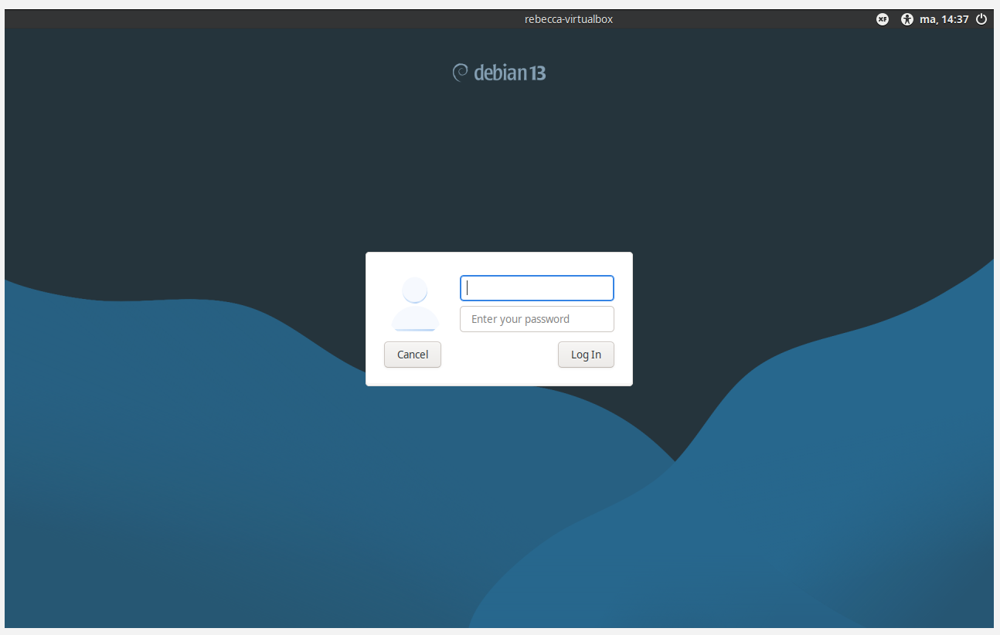

# Summary of Hutchins et al 2011: Intelligence-Driven Computer Network Defense Informed by Analysis of Adversary Campaigns and Intrusion Kill Chains 
•	Advanced Persistent Threats (APTs), skilled attackers with vast resources, conduct long, coordinated campaigns to access sensitive information.

•	Conventional methods fail to address APTs because they fail to intervene before the breach occurs. However, by mapping out the steps that APTs follow and applying mitigations accordingly, the kill chain model can disrupt APTs before a breach occurs.

•	Kill chain phases:

  Reconnaissance – researching target(s)
  
  Weaponization – malware is paired with an exploit
  
  Delivery – weapon delivered to target
  
  Exploitation – intruder’s code is triggered
  
  Installation – backdoor is created
  
  Command and Control – outside server connects to weapon and provides access
  
  Actions on Objectives – intruders retrieve data

•	It makes sense that targetting specific actions in a chain of events would be more effective than viewing attacks as a singular event. I wonder since the kill chain model was adopted, if attackers have adapted their behavior and how.

 # MITRE ATT&CK

In the context of MITRE ATT&CK, a tactic is a purpose behind an adversary’s actions, the goal they wish to accomplish. For example, they may be hoping to gain their target’s banking credentials.

A technique is the method an adversary uses to obtain their goal. An example of this would be phishing.

Sub-techniques are more detailed descriptions of techniques. A sub-technique of phishing would be a spearphishing link.

A procedure is the specific way that an attacker implements the sub-technique. In this example, this would be by sending the target an email pretending to be the target’s bank, using the bank’s logo and communication style, and linking them to a doppelganger site which, if used, sends login credentials to the attacker.

# Linux Installation

